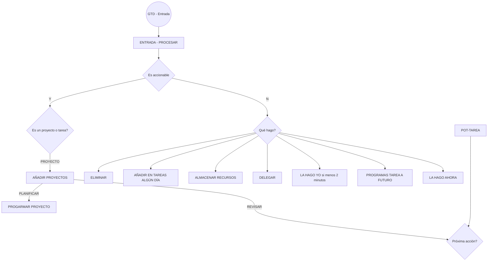

```mermaid
graph TD;
A((GTD - Entrada))
A-->B[ENTRADA - PROCESAR];
B-->C{Es accionable};
C--Y-->POT{Es un proyecto o tarea?};

POT--PROYECTO-->LISTA[AÑADIR PROYECTOS]
LISTA--REVISAR--->E
LISTA--PLANIFICAR-->PLNA[PROGARMAR PROYECTO];
POT-TAREA---->E{Próxima acción?};

C--N-->M{Qué hago?};
M-->N[ELIMINAR];
M-->O[AÑADIR EN TAREAS ALGÚN DÍA];
M-->P[ALMACENAR RECURSOS];
M-->R[DELEGAR];
M-->S[LA HAGO YO si menos 2 minutos];
M-->T[PROGRAMAS TAREA A FUTURO];
M-->U[LA HAGO AHORA];
```